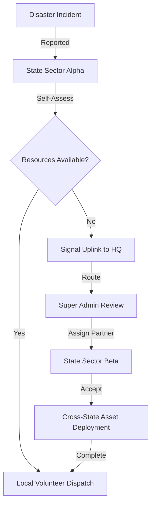

# 🌊 GRANDLINE AI : The Autonomous Disaster Command Center


> **Centralized Command. Decentralized Execution. Real-time Survival.**

GrandLine AI is a high-fidelity, production-grade disaster response platform designed to orchestrate massive resource allocation across state boundaries. By combining **Generative AI** for autonomous decision-making with a **Centralized Command Hierarchy**, it ensures that no crisis goes unanswered and no resource is wasted.

---

## ⚡ CORE CAPABILITIES

### 🏛️ Centralized Inter-State Assistance
*   **Command-Based Routing:** State Admins uplink assistance signals directly to National HQ.
*   **Authorized Deployment:** Super Admins review situational reports and route resource partners across state lines.
*   **Jurisdictional Integrity:** Controlled escalation path ensures authorized and logged resource sharing.

### 🧠 AI-Driven Intelligence (Powered by Gemini)
*   **Autonomous Resource Matching:** Real-time analysis of volunteer skills vs. incident requirements.
*   **Crisis Scoring:** Automated urgency scoring for incoming disaster reports.
*   **Tactical Briefings:** Instant AI-generated status reports for high-level decision makers.

### 🗺️ Tactical Command Interface
*   **Real-time GPS Tracking:** Precise location monitoring for field volunteers.
*   **Coordination Vectors:** Dynamic map polylines visualize support corridors and asset movement.
*   **Glassmorphic Mission Control:** A cinematic, high-contrast dark UI designed for low-latency situational awareness.

---

## 🎭 ROLE-BASED ACCESS CONTROL (RBAC)

| Role | Responsibility | Tactical Reach |
| :--- | :--- | :--- |
| **Super Admin** | National Oversight | Global Routing, Resource Analytics |
| **State Admin** | Sector Command | Local Dispatch, HQ Escalation |
| **Volunteer** | Field Execution | Incident Response, Real-time Reporting |

---

## 🛠️ TECH STACK

*   **Frontend:** React 18, Vite, Tailwind CSS (Glassmorphism)
*   **Backend:** Firebase (Firestore, Authentication, Cloud Functions)
*   **Intelligence:** Google Gemini 1.5 Pro
*   **Visuals:** Google Maps Javascript SDK (Tactical Visualization)
*   **Comms:** Secure Tactical Channel (Bespoke internal messaging)

---

## 🚀 GETTING STARTED

### Prerequisites
*   Node.js (v18+)
*   Firebase Project Credentials
*   Google Maps API Key
*   Gemini API Key

### Installation

1.  **Clone the Repository**
    ```bash
    git clone https://github.com/your-username/grandline-ai.git
    cd grandline-ai
    ```

2.  **Install Dependencies**
    ```bash
    npm install
    # and for functions
    cd functions && npm install && cd ..
    ```

3.  **Environment Configuration**
    Create a `.env.local` in the root:
    ```env
    VITE_FIREBASE_API_KEY=your_key
    VITE_GOOGLE_MAPS_API_KEY=your_key
    VITE_GEMINI_API_KEY=your_key
    ```

4.  **Launch Dashboard**
    ```bash
    npm run dev
    ```

---

## 📐 ARCHITECTURAL ESCALATION PATH



---

## 📜 LICENSE

GrandLine AI is developed for high-impact humanitarian response and stability. All tactical patterns and AI logic are proprietary to the GrandLine Protocol.

---

> "In the face of chaos, data is the only anchor." — **GrandLine Command HQ**
