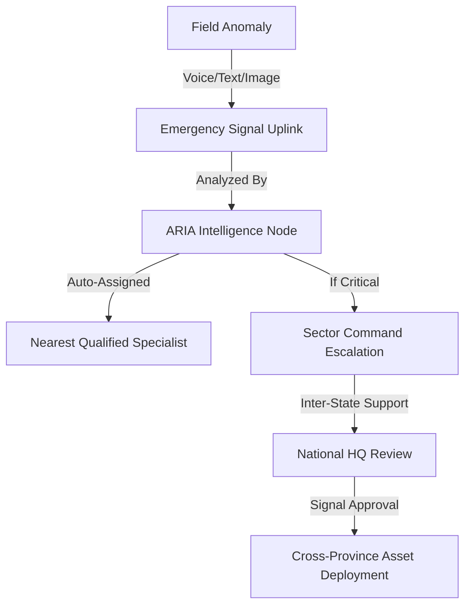

# 🌊 GRANDLINE AI : The Autonomous Disaster Command Center


> **Centralized Command. Decentralized Execution. Real-time Survival.**

---

### 🌐 PROTOTYPE SUBMISSION INFRASTRUCTURE
*   **Live MVP Link**: [https://studio-9997977370-a3c13.web.app](https://studio-9997977370-a3c13.web.app)
*   **Demo Video**: [Add Link Here]
*   **Project Deck**: [Add Link Here]

#### 🔐 TEST CREDENTIALS
| Role | Email | Password |
| :--- | :--- | :--- |
| **National Admin** | `admin@grandline.ai` | `password` |
| **State Admin** | `keralahq@grandline.ai` | `password` |
| **Volunteer/Field** | `specialist1@grandline.ai` | `password` |

---

### 🏆 Winning Entry for Disaster Response Innovation

GrandLine AI is a production-grade, high-fidelity **Autonomous Disaster Operating System (ADOS)** designed to orchestrate national-scale emergency response. Built with a "Mobile-First, Tactical-Always" approach, it bridges the gap between field chaos and structured command intelligence.

---

## ⚡ MISSION-CRITICAL CAPABILITIES

### 🗣️ SARVAM AI: Multi-Modal Indic Intelligence
*   **Neural Voice Link**: Real-time speech-to-text pipeline using the **Sarvam AI 'saaras:v3'** model.
*   **India-Native Localization**: Full support for **10 major Indian languages** (Hindi, Telugu, Tamil, Marathi, etc.), allowing field workers to report in their native dialect.
*   **Dialect-Aware Transcription**: ARIA automatically calibrates its neural link to the regional dialect for human-level accuracy.

### 🧠 ARIA: The AI Allocation Engine
*   **Autonomous Intent Extraction**: AI-driven analysis of raw field reports to identify urgency, categories (Medical, Rescue, Food), and location.
*   **Skill-Aware Asset Allocation**: Dynamically routes reports to the nearest qualified specialist regardless of department—enforcing a universal response protocol.
*   **Smart Resource Sync**: Real-time cross-state resource sharing reviewed by National HQ.

### 🏗️ Decentralized Operational Decks
*   **Command Deck**: Precision mapping and mission tracking for en-route specialists.
*   **Emergency Signal Uplink**: A dedicated, zero-latency interface for raising alerts with visual evidence & voice notes.
*   **National Monitoring**: A 30,000-ft view for HQ to manage state-level escalations and inter-state support.

---

## 🎭 THE COMMAND HIERARCHY

| Tier | Role | Tactical Scope |
| :--- | :--- | :--- |
| **National HQ** | Super Admin | Inter-State Asset Movement, Strategic Routing |
| **Sector Bridge** | State Admin | Regional Logistics, Volunteer Coordination |
| **Field Specialist** | Volunteer | Incident Reporting, Visual Verification, SAR Operations |

---

## 🛠️ THE TACTICAL STACK

*   **Logic Hub**: React 18 & Vite (High Performance)
*   **Intelligence Node**: Google Gemini Pro (Situational Assessment)
*   **Indic Voice Node**: Sarvam AI 'saaras:v3' (Dialect Transcription)
*   **Operational Persistence**: Firebase (Firestore, Auth, Cloud Functions)
*   **Mapping Grid**: Google Maps SDK (Tactical Overlays)
*   **Styling**: Vanilla CSS with custom Tactical Dark Design System

---

## 🚀 DEPLOYMENT PROTOCOL

### 1. Terminal Setup
```bash
git clone https://github.com/SaiDheeraj-19/GrandLine-AI.git
cd GrandLine-AI/smart-resource-allocation
npm install
```

### 2. Neural Calibration (.env)
```env
VITE_FIREBASE_API_KEY=********
VITE_GOOGLE_MAPS_API_KEY=********
VITE_GEMINI_API_KEY=********
# SARVAM AI Integration Active
```

### 3. Launch Signal
```bash
npm run dev
```

---

## 📐 THE LOGIC CORRIDOR



---

## 🛡️ SECURITY & STABILITY

*   **Auth Enforcement**: Zero-anonymous access; mandatory cleared roles.
*   **Tactical Dark Profile**: Enforced dark-mode UI for reduced glare in field conditions.
*   **Deterministic Simulation**: Hardened for demo success with predictable emergency flows.

---

> "In the face of chaos, intelligence is the only lifeline." — **GrandLine Command HQ**
